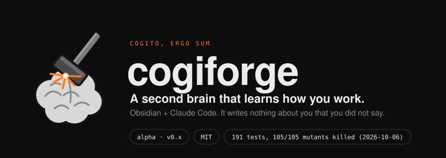
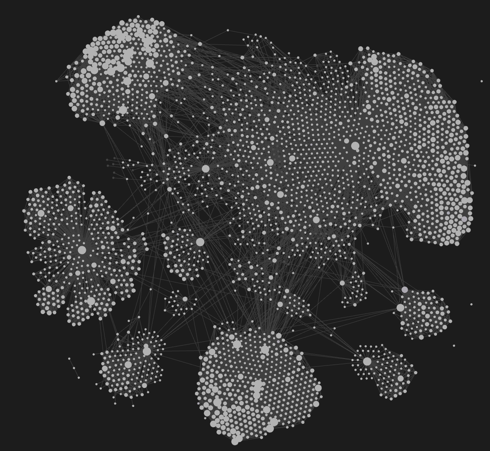
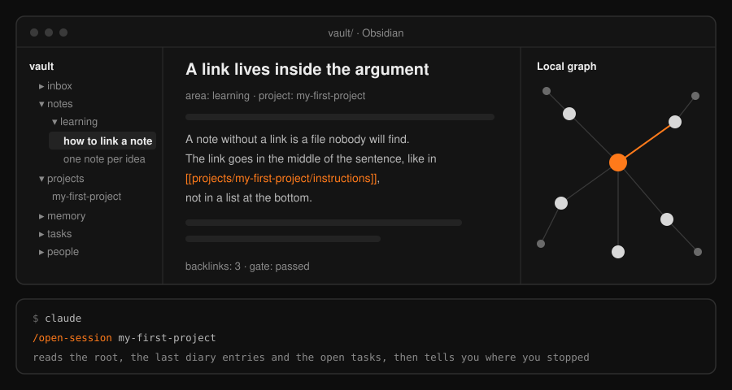
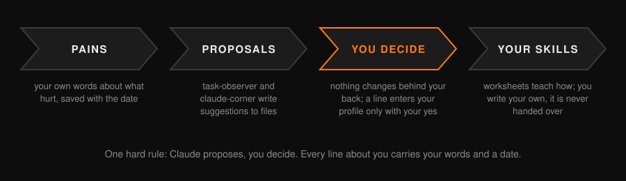
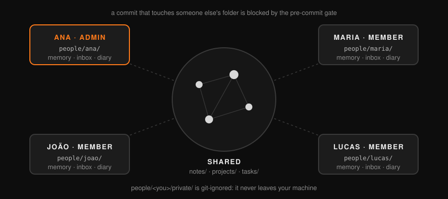
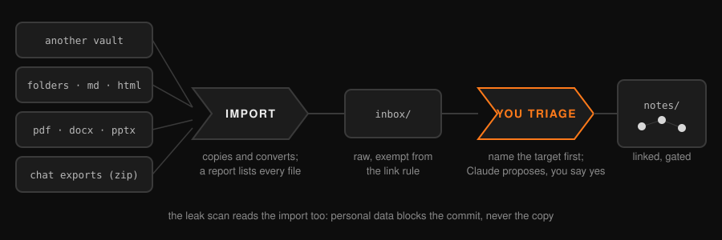

<p align="center">
  
</p>

**cogiforge is a second brain on Obsidian + Claude Code that learns how you work, and writes nothing about you that you did not say.** *Cogito, ergo sum*: a creative workbench for your head. It holds your work, your school and your personal life in one place, **organizes your projects, ideas and tasks, helps you write and plan, and gets better with you** as you use it.

> **Status: alpha (v0.x).** Built from the author's own working vault and used, so far, only by the
> author. Skills, docs and the vault template are in English. If you want to use it in Portuguese, see
> docs/TRANSLATING.md (glossary and a checklist). Step by step for each part: [TUTORIAL.md](TUTORIAL.md).

<p align="center">
  
</p>

## Why it exists

cogiforge came out of using Claude on a real vault. Three decisions shaped it:

1. **Claude does not decide who you are.** Nothing about you is written unless you said it. A line only enters your profile with your "yes", the date and your literal quote.
2. **A rule stays only if a real failure justifies it.** Every rule in this repo comes from a dated mistake, and has a test that goes red without it. Examples from [WHY.md](WHY.md): a link checker that reported OK while 58 links were broken, a check that touched nothing and still said OK, a gate that was bypassed with `--no-verify` three times and then six.
3. **It proposes, you decide.** The skills write suggestions to files. Nothing changes behind your back.



*The author's own vault, drawn as a graph. Every dot is a note and every line is a link between two notes. File names are removed.*

## What you get

| Piece | What it does |
|---|---|
| `vault/` | The workbench: `inbox/` for quick capture, `notes/` for processed notes, `projects/` with one root file per project, `memory/` for what *you* told it, `tasks/` for tasks. Open this folder in Obsidian. |
| `/cf-onboard` | Onboarding. Asks one question at a time, each following your last answer, and writes what **you said**, dated and quoted. It never guesses. |
| `/cf-open-session <project>` | Starts work on a project: reads its root file, the last diary entries and the open tasks, and tells you where you stopped. |
| `/cf-close-session` | Ends the day: diary, a briefing per session, the **pains you voiced** collected in one file, tasks opened for what is pending. It commits only if you say so and never pushes. |
| `/cf-task-observer` | Watches how you work and **only proposes** improvements (a missing skill, a step you repeated three times, a correction you made twice). You decide. |
| `/cf-claude-corner` | When you say you are leaving, Claude uses that time to reread your notes, find real connections and test ideas in a throwaway place. It **only proposes**, in a file. |
| Tasks (**TaskNotes**) | Tasks are notes in `vault/tasks/`, managed by the public [TaskNotes](https://github.com/callumalpass/tasknotes) Obsidian plugin (MIT). Not bundled: you install it from Obsidian's community plugin store. `cf-open-session` and `cf-close-session` read and write the same format. |
| Connection map (**graphify**, optional) | The public [graphify](https://github.com/Graphify-Labs/graphify) (Apache-2.0) maps your notes into a graph you can query. Install it yourself; its output folder is git-ignored. See the tutorial. |
| `/cf-brainstorm` | Brainstorming for any product, project, study, event or loose idea. Checks what the vault already says, proposes **three genuinely different paths**, compares them on criteria you choose, recommends one **without choosing for you**, and stops at a brief you approve. No code and no plan before your "yes". |
| `/cf-extract-routine` | Gets a real routine out of your head by interview, one question at a time. What you do not know stays `[CONFIRM]`; Claude never invents a step. It can reach `ready-for-human-review`; `validated` needs a second person who follows the order without guessing. |
| `/cf-whats-real` | Keeps, per project, what **works (with proof)**, what is **simulated or a demo**, and what is **unknown**. An item moves to "works" only with proof run again. |
| `/cf-know-my-product` | Interviews you about your product and collects your pains with your literal words and the date, then proposes a ranking. You approve before anything is saved. |
| `/cf-import-knowledge` | Brings an existing base (another vault, a folder, documents, chat exports) into the inbox and walks you through the triage, target first. See *Bringing an existing knowledge base*. |
| `/cf-adapt-skill` | Helps you write **your own** skill from a worksheet in `vault/skill-worksheets/`. One question at a time; Claude never writes it for you, and "this is not for me" is a valid answer that gets recorded. |



*The workbench in use: Obsidian on `vault/`, Claude Code at the repo root.*

## How it improves with you

Three loops, and in all of them the decision stays with you:

1. **Pains.** At the end of a session your own words about what hurt are saved, dated, in `vault/memory/ideas/_pains.md`.
2. **Proposals.** `cf-task-observer` and `cf-claude-corner` write suggestions to files. Nothing is changed behind your back.
3. **Your own skills.** The worksheets teach how a skill is built, and `cf-adapt-skill` walks you through making yours. You are not handed a finished one.



One hard rule runs through everything: **Claude does not write anything about you that you did not say.**
It proposes; a line only enters your profile with your "yes", with the date and your literal quote.

## Quickstart

You need `git`, Python 3.10+, Obsidian and Claude Code. macOS and Linux; Windows is untested. To run this
repo's own tests you also need `pytest` (`python3 -m pip install pytest`); nothing else in the repo uses it.

```sh
git clone https://github.com/Arthuro0103/cogiforge.git
cd cogiforge
sh install.sh      # turns the pre-commit hook on and proves it works
claude              # run Claude Code at the repo root
```

Then, inside Claude Code, type `/cf-onboard`. Open `vault/` as a vault in Obsidian. When you have a
project, `/cf-open-session <name>` to start and `/cf-close-session` to end the day. The example project
`vault/projects/example-my-first-project/` shows the shape. Tasks need the public TaskNotes plugin
(install it from Obsidian's community plugins), and the optional connection map needs graphify: both are
in the [tutorial](TUTORIAL.md).

## Teams and schools



One vault for a group, one folder per person: `vault/people/<handle>/` (memory, inbox, diary). Turn it on with
`sh install.sh --team <your-handle>`: it writes `vault/roles.txt` with you as admin (your `git config user.email`)
and copies `vault/people/_template/`. Add people as lines `handle  admin|member  email`. Without `roles.txt`
nothing changes: solo mode is identical.

- **admin** passes everything. **member** works in their own folder, in `notes/`, and in existing projects; the pre-commit hook blocks a member who touches another person's folder, `roles.txt`, `areas.txt`, or creates a project, and blocks an author who is not in `roles.txt`.
- **The honest limit:** git has no permission per folder. The roles are a convention plus a local hook, and `git commit --no-verify` skips it. Real enforcement is the host: add a `CODEOWNERS` file (for example `vault/roles.txt @your-org/admins` and `vault/people/ana/ @ana`) and turn on branch protection with required reviews.
- **Everyone who clones reads everything.** What is intimate goes in `vault/people/<handle>/private/`, which is gitignored and never leaves your machine.
- `install.sh --team` lists `vault/roles.txt` in `.leakignore`, because the e-mails there are deliberate.

## Guides

- [AGENTS.md](AGENTS.md): the operating rules in a form any coding agent reads (Codex, Cursor, Gemini CLI, Copilot, Claude Code).
- [docs/EXPORTING-CHATS.md](docs/EXPORTING-CHATS.md): export your chat history from claude.ai, ChatGPT or Gemini and bring it into the vault with `tools/import_chats.py`.
- [docs/RESEARCH.md](docs/RESEARCH.md): research with the vault: your notes first, the internet second, every outside claim marked until checked.
- [docs/USING-OTHER-MODELS.md](docs/USING-OTHER-MODELS.md): use the vault with agents other than Claude Code, and what you lose without its skills.
- [docs/SYNC.md](docs/SYNC.md): keep the vault in sync without duplicates or conflicts, and what the commit guard catches.
- [docs/STUDENTS.md](docs/STUDENTS.md): study what you want, the way you want, with `/cf-study <topic>`: recall questions, a mastery log and retests on another day.

## Context, worksheets and pains

Claude helps in proportion to the context it has, so the workbench teaches you to keep that context small,
specific and in your own words.

- [docs/CONTEXT.md](docs/CONTEXT.md): what loads in every session, what loads only on demand, where each thing lives, signs of bad context, and tips for personal, team and school use.
- [docs/PRODUCT-AND-PAINS.md](docs/PRODUCT-AND-PAINS.md): how the workbench learns your product and collects your pains, and how to ask "what do I build first?".
- Worksheets in [`vault/worksheets/`](vault/worksheets/): [product-brief](vault/worksheets/product-brief.md), [pains](vault/worksheets/pains.md), [audience](vault/worksheets/audience.md), [project-brief](vault/worksheets/project-brief.md), [decisions-log](vault/worksheets/decisions-log.md), [weekly-review](vault/worksheets/weekly-review.md). `pains` and `decisions-log` also come as CSV in `vault/worksheets/csv/` for Sheets or Excel.
- `/cf-know-my-product <project>`: interviews you one question at a time and fills the product brief with your words only.

## What keeps it healthy

This is the foundation under the workbench. It is deliberately small and runs on Python's standard library only.

- **Orphan gate.** The pre-commit hook blocks a note that links to nothing and nothing links to. `inbox/` is exempt: if quick capture gets blocked, people uninstall the thing. Only notes in *that* commit are blocked; others just get a warning.
  Too strict for you? Put `orphan: warn` in `vault/gate.txt` and the same report becomes a warning that lets the commit through. The default is `block`, and a `gate.txt` the gate cannot understand blocks the commit instead of passing. The leak scanner never reads this file.
- **Link check** (`core/gate.py`). Dead links, broken links, a path that only matches by file name, a bad `area:`, unreadable files (reported as "could not read", never as OK).
- **Leak scanner** (`core/leak.py`). Blocks machine paths, e-mails, phone numbers, CPF and a **private list of terms that lives outside the repo**. Without that list it says `NOT_VERIFIED`, never "clean".
- **No Portuguese by accident** (`tests/test_no_portuguese.py`). The repo moved to English in October 2026, and this test fails on accented letters, common Portuguese words and the old Portuguese folder and script names. The few deliberate exceptions are in `tests/pt_allowlist.txt`, one `path: reason` per line, and a second test fails when an exception no longer exists or no longer needs to be one.
- **CI** (`.github/workflows/prova.yml`). Installs from a clean clone, runs the tests and the mutation check, and tries the orphan gate end to end. The step that proves the hook test goes red now insists on that exact failure: a renamed test once made it print "ok" without testing anything.

The hook can be bypassed on purpose with `git commit --no-verify`. Every rule here comes from a real,
dated failure, and each one has a test that fails without it: see [WHY.md](WHY.md).

## What is verified, and what is not

Measured on 2026-10-07, after team mode, the importers and the new skills were merged, on one machine (macOS), in the merged checkout:

- Tests: after `sh install.sh` and `python3 -m pip install pytest`, `python3 -m pytest -q` gave **371 passed, 2 skipped**. Run before `sh install.sh`, one test fails on purpose: it checks that the hook is active.
- Mutation: `python3 tests/mutate.py` breaks every check one at a time and gave **196 of 196 mutants killed, 0 alive** (measured on the team-mode branch; the merge changed none of the mutated files). `python3 tests/mutate.py --dry` only checks, in seconds, that every mutant still applies (196 do, 0 inapplicable, run again on the merged tree), so a rename that breaks one is caught before the long run.
- CI: the run for the merged version ([run 37625368269](https://github.com/Arthuro0103/cogiforge/actions/runs/37625368269), 2026-10-07, commit `a73202a`) had **8 of 8 jobs green**, on ubuntu and macOS with Python 3.10, 3.11, 3.12 and 3.13. Each job starts from a clean checkout, runs `install.sh`, the tests, the mutation check and the leak scan, and proves the orphan gate end to end.
- Two tests compare this link checker with the author's private vault, which is not in this repo. They are **skipped** (reported as skipped, not as passed).
- **Nobody other than the author has used it yet.** If you are the first, tell us where you got stuck: that is the most useful thing you can send.

## Roadmap

`artigo`, `conselho`, `product-idea` and `consult-notes` as real skills (their worksheets are in `vault/skill-worksheets/` today); a skill that turns one of your own failures into a rule plus a test.

## Bringing an existing knowledge base



A team, a school or a person usually starts with notes that already exist. The import is a copy plus a
conversion: your originals are never touched, and nothing is dropped in silence.

```sh
python3 tools/import.py ~/old-wiki --dry-run          # plan: prints the report, writes nothing
python3 tools/import.py ~/old-wiki [--person HANDLE]  # into vault/inbox/imported/old-wiki
```

It writes `_import-report.md` next to the copy: every file of the source is listed as converted, copied,
unchanged, ignored or not converted, with the reason, and the count has to close. It then runs the leak
scanner on the result and lists `file:line:type` (never the data); a leak does not stop the copy, but the
commit is blocked until it is cleaned. Imported files land in an inbox, which the orphan gate exempts. Moving
one into `notes/` takes a named target and a link in the body: the `cf-import-knowledge` skill walks you through it.

| Format | What happens |
|---|---|
| `.md`, `.txt`, `.html`, `.csv`, `.json`, images (`png jpg gif svg webp`) | **Direct**, standard library only: markdown is copied unchanged, `.txt` becomes `.md`, HTML becomes simple markdown, CSV becomes a table, JSON a code block, images are copied as they are |
| `.pdf`, `.docx`, `.pptx`, `.xlsx` and similar | **With [docling](https://github.com/docling-project/docling)** (`python3 -m pip install docling`): converted to markdown. Without it they are copied to `_unconverted/` and listed with the install command |
| Anything else (archives, audio, video, ...) | **Not supported**: copied to `_unconverted/` and listed, never discarded |

Ignored and listed: `.git`, `.obsidian`, `.trash`, `node_modules`, `__pycache__` and hidden files. Skipped and
listed: iCloud files that are not downloaded yet, unreadable files and symlinks.

## Adopting a vault you already have

If your notes already live in an Obsidian vault, you do not need to start from zero or copy them anywhere.
`tools/adopt.py` works in place:

```sh
python3 tools/adopt.py ~/my-vault                  # dry run (the default): prints the plan, writes nothing
python3 tools/adopt.py ~/my-vault --apply --yes    # writes only what the plan listed
```

The plan lists the areas it infers from your top-level folders (a proposed `areas.txt`), what it would install
(a pre-commit hook that calls this repo's gate, ring and leak scan, plus a small config), and the **debt you have
today**: orphan notes, dead links and notes without `area:`, saved as `.cogiforge/baseline.json`. The hook only
judges the notes in each commit, so the old debt blocks nothing; it only stops new problems from entering.
The dry run prints the full text of the hook, which runs on every commit and finds this repo through your local git config (never through a file in the vault). Adopt asks git itself to list a private copy of `.git/config` (running nothing) and accepts only what `git init` or `git clone` write (plus its own two keys); anything else, such as a filter, an alias, an include or a pager, blocks it with the line cited, so a vault received from someone else cannot run anything through its git config. Text that comes from the vault is shown with control characters escaped, so it cannot rewrite your terminal. It also refuses symlinks on the paths it writes and a `.githooks` folder that holds anything but its own hook. The hook trusts the cogiforge checkout you point it at (`cogiforge.home`): it checks that the three scripts exist there, not who wrote them, so use a clone of your own. If the vault already has a different `.githooks/pre-commit`, adopt refuses to activate it and applies nothing until you have read it and decided. An existing file is never overwritten (it becomes a conflict in the report), no note is ever touched, and the tool
never runs `git init` for you. Notes that are iCloud placeholders not yet downloaded, or unreadable, are skipped
and listed, never counted as fine. The `cf-adopt` skill walks you through it.

## License

MIT. See [LICENSE](LICENSE).
